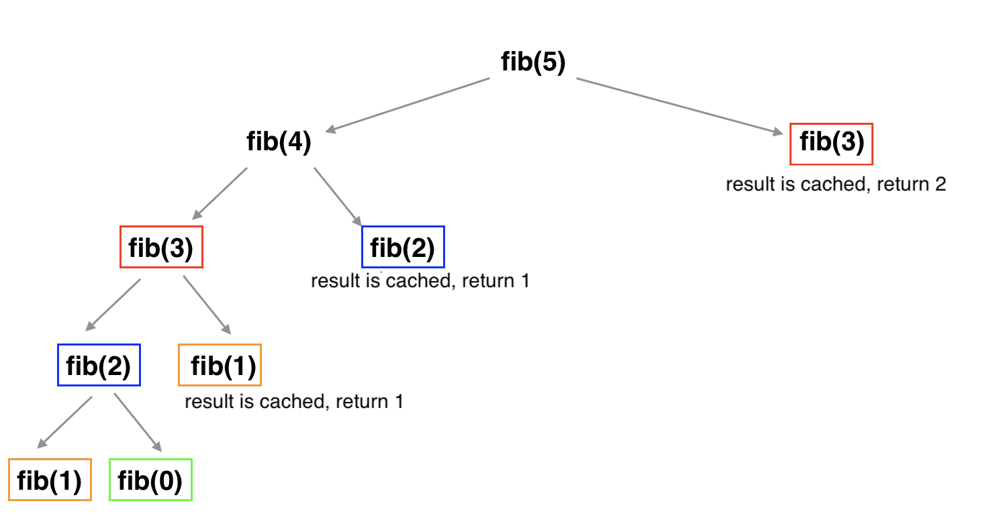
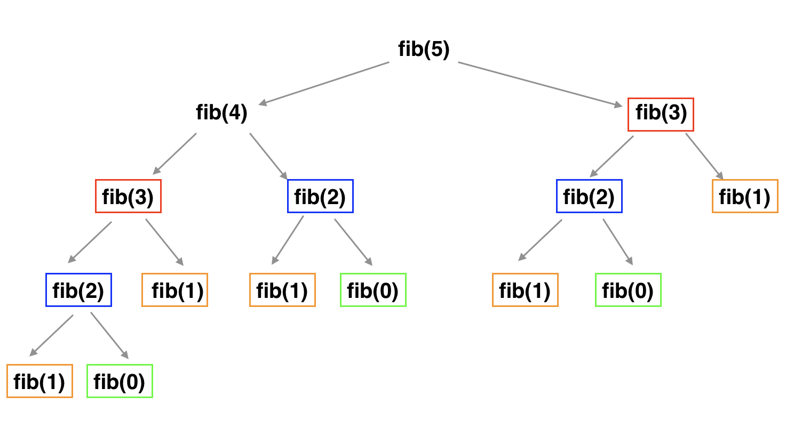

## Recursive memoization of fib results
### time complexity: O(n)
### space complexity: O(n)

Similar to the solution outlined below in **memoize fib results**, this solution creates a storage variable to hold a cache of results and recursively makes calls to calculate fibonacci numbers. However, as discussed below, the global storage variable can be improved by creating a memo closure instead. First, two variables are created- 'storage' and 'memo'. 'storage' is a dictionary that holds the cached results and 'memo' is the closure which holds the fib algorithm and is recursively called rather than recursively calling the fib function. This allows for the storage to stay within the bounds of the function and avoid global variables. This ultimately preserves space, as the storage can be discarded after the function is run.

The time complexity for this solution is O(n) due to every value of n needing to be calculated for their fib value, but only needing to be calculated once because of the cached storage. Space complexity is O(n), accounting for the call stack as well as the storage variables holding the cached results.

## Memoize fib results
### time complexity: O(n)
### space complexity: O(n)

To improve upon the simple solution of recursively calculating fib numbers, as shown below in **recursively calculate fib numbers**, memoization can be introduced. A memo variable can be created that will store a cached memory of results to avoid repeat recursive calls. If the fib input is in the cache, it will be returned instead of running the fib algorithm. If the input is not in the cache, the fib algorith will run and add the result into the cache before returning the result. The following code shows a working solution:
```swift
var memo: [Int: Int] = [:]

func fib(_ n: Int) -> Int {

    if let memo = memo[n] { return memo }

    let result = n <= 1 ? n : fib(n-1) + fib(n-2)
    memo[n] = result
    return result
}
```

This approach massively improves the time compared to no memoization! Repeats are no longer an issue, as seen in the diagram below. Our runtime for the large input of fib(50) now decreases from 150 seconds to a very small fraction of a second.


The time complexity of this solution improves to O(n) with memoization as compared to O(2^n) without, as each input will only be executed once to find the result. Space complexity is also O(n) to account for the call stack as well as the memo variable holding the cached results.

While our time and space complexity is satisfactory, there is an issue of the memo variable, which in this case is a global variable. This could become difficult to manage if multiple memos are introduced and accessed by other functions when it is only relevant to the fib function. A solution should be discussed that removes this global variable but still use memoization to keep the time and space complexity.

## Recursively calculate fib numbers
### time complexity: O(2^n)
### space complexity: O(2^n)

The well-known solution to fibonacci is recursively calling the fib function to get the fib result of the n-1 and n-2. This can be done with the code:
```swift
func fib(_ n: Int) -> Int {
    n <= 1 ? n : fib(n-1) + fib(n-2)
}
```

This solution is quite easy to understand, with the whole function being a single line. However, there are massive amount of repeats because the results are not being stored, and are instead being recalculated for each fib call. See below for a diagram of repeats:


In this small example of fib(5), it can be seen that fib(3) repeats twice, fib(2) repeats three times, and fib(1) repeats 5 times! This is a lot of repeat for such a small call stack. When running a large input, such as fib(50), the output takes 150 seconds to complete! The time complexity of O(2^n), as the function will call itself 2 times for a length of n input. Space complexity is O(2^n) to account for the call stack. This can be drastically improved with memoization. 


### Source: https://www.hackingwithswift.com/plus/high-performance-apps/using-memoization-to-speed-up-slow-functions
