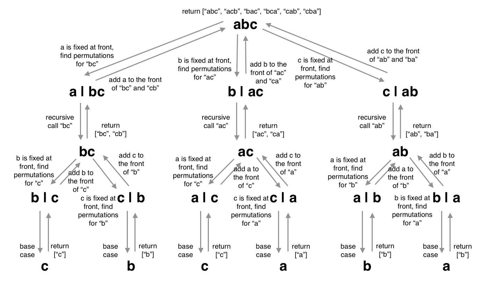

## Recursively find permutations of substrings
### time complexity: O(n! x n^2)
### space complexity: O(n! + n)

Because the question asks for a recursive solution, the solution uses recursion to find permutation of smaller and smaller substrings of the input, until hitting the base case of a single character. The input string is iterated, creating a new substring in each iteration with the current character removed. The permutations of that substring are found and returned, and permutations are iterated. The current charcter is placed in front of each permutation to create new permutations possibilities. 

An example of the input "abc" is shown in the diagram below.

with the inputString "abc", each character is iterated and the new input string is created with the current character removed. In the first iteration, "a" is removed to create the new input "bc", and "bc" is recursively called to find permutations. The input string now becomes "bc". "b" is the first iteration and is removed from the string to create the new input string "c". "c" is recursively called and the base case is hit as a single character. "c" is returned to "b", and "b" is added to the front of "c". "bc" is then returned to "a", where "a" is added to the front to create "abc". This process continues for all iterations as shown in the diagram. 

The time complexity of O((n^2)!) comes from the recursive time of permutations (n!) and the nested loops (n^2) within each recursive call. Permutation time complexity is a relatively well known concept, as n! = n x (n - 1) x (n - 2)... until reaching zero. However, because there is a nested loop in the algorithm, the value of n in the time complexity of a permutation becomes n^2 instead. It should be investigated on how to remove the nested loop to improve the time complexity. The space complexity is O(n! + n), resulting from the call stack of permutations (n!) and the permutations set that stores the results of permutations.
