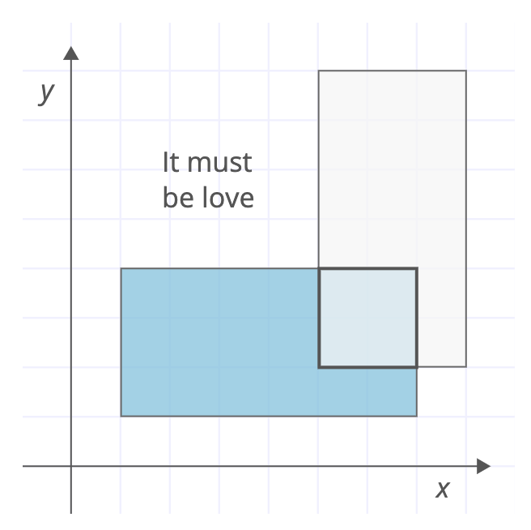

## Use math
### time complexity: O(1)
### space complexity: O(1)

By utilizing maths, a solution that is more foolproof and easier to read compared to the solution in **Lots of conditionals** can be found. The figure from the problem statement will be used to visualize the solution. rect1 will be the blue rectangle, and rect2 will be the gray rectangle.



The leftX and width are found by first checking which rectangle is closer to the x-axis. 
If rect1 is closer to the x-axis, the overlapping leftX will be the leftX of rect2. Looking at the example, rect1 is closer to the x-axis, determining the leftX of the overlap will be the same as rect2.leftX. 
The width is found by again seeing which rect is closer to the x-axis. If rect1 is closer to the x-axis, the width of the overlapping rectangle will be calculated by finding the end point of rect1 with rect1.leftX + rect1.width, and subtracting the leftX of rect2. In the example, the equation *(rect1.leftX + rect1.width) - rect2.leftX* will be *(1 + 6) - 5*, resulting in the expected width of 2. In the instance that rect2 is inside rect1, the minimum value between this calculation and the rect2.width is taken, as it is known the overlapping rectangle cannot be greater than the width of rect2. 
In the case that rect2 is closer to the x-axis, the same calculations are used but vice versa rects.

The bottomY and height are found similar to the leftX and width, but using the bottomY and height variables of respective rectangles instead. The rectangle closer to the y-axis is first found, and similar calculations as above are done.

The time and space complexity are O(1), as time and space are constant and not dependent on the input. This is the same as the solution below, but is much better in terms of edge cases and readability. All edge cases will be covered and understanding the code is much easier.

## Lots of conditionals
### time complexity: O(1)
### space complexity: O(1)

The first solution considered was to use conditionals to check for left, right, top, and bottom intersections and determine overlap based on those intersections. Intersections are based off where rect2 intersects with rect1. Below are code examples of what each intersection would look like.

Left intersection
```swift
rect1.leftX <= rect2.leftX && rect1.leftX + rect1.width > rect2.leftX
``` 

Right intersection
```swift
rect2.leftX <= rect1.leftX && rect2.leftX + rect2.width > rect1.leftX
``` 

Bottom intersection
```swift
rect1.bottomY <= rect2.bottomY && rect1.bottomY + rect1.height > rect2.bottomY
``` 

Top intersection
```swift
rect2.bottomY <= rect1.bottomY && rect2.bottomY + rect2.height > rect1.bottomY
``` 

Nesting these can determine wether the intersection is a left, top left, bottom left, bottom, left bottom, right bottom, etc. etc. intersection. Parameters of the overlapping rect can then be determined.

Tthe time and space complexity of this algorithm is O(1) as there is no extra space or time needed no matter the input. However, there is room for mistakes and the code is quite clunky. The above solution does not account for both rectangles being the same or one rectangle inside the other. It would be very easy to find edge case tests and break the solution, and it is difficult to read and understand. Because of this, another solution should be considered

