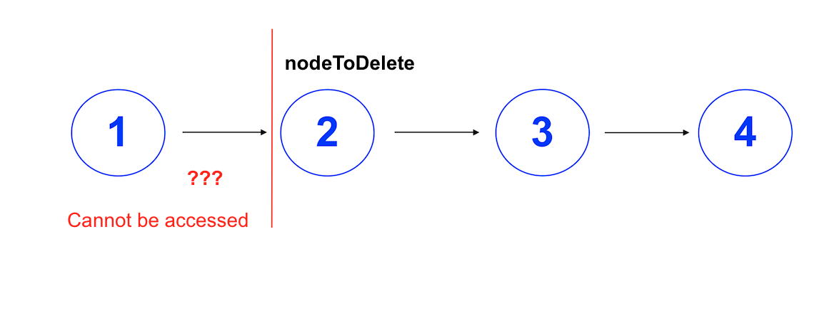
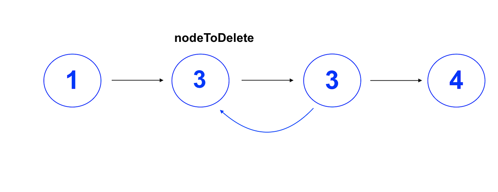
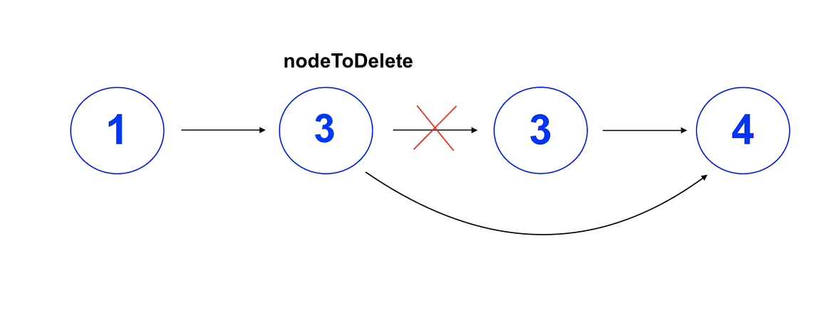
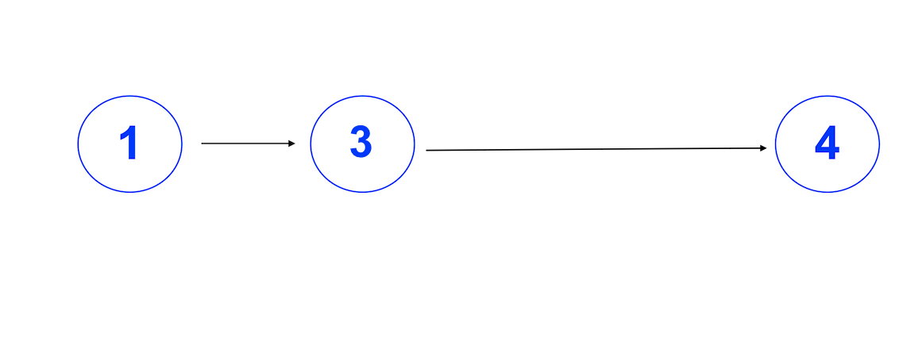

## Get the next value and pull it back into current value, then delete next node
### time complexity: O(1)
### space complexity: O(1)

This problem needs some creative thinking, as the head of the list is not given as an input. If the head was given, it would be possible to find the node before the node to delete, and overriding its next value to the node after node to delete. However, it is not possible to get the node before node to delete in this problem, therefore needing to involve some creative thinking.

The information given that can be worked with is:
* the current node
* the next node
* all nodes after next node



Because we do not have information on the node before, the connection to the node that should be deleted needs to be kept in tact. That means the node to be deleted cannot be fully removed from the list. **However, the node itself does not actually matter but only the value of that node.** Because of this, the value of the node that should be deleted can simply be overridden rather than fully removing it from the list. This means it will get a new value, but still keep the connection to the node before.
```swift
nodeToDelete.value = nextNode.value
```



Now there are two nodes next to each other that have the same value. Because we have access to all the nodes after the node to delete, we can safely remove the now repeated connection after node to delete. Node to delete will get a new next node, being nextNode.next.
```swift
nodeToDelete.next = nextNode.next
```



Now the output is as expected.



This solution has a time complexity of O(1) as the whole data set does not need to be used. The space complexity is O(1) as well, since the only space created is a single variable. This is the only possible solution for this problem becuase of the lack of access to the head of the linked list.
