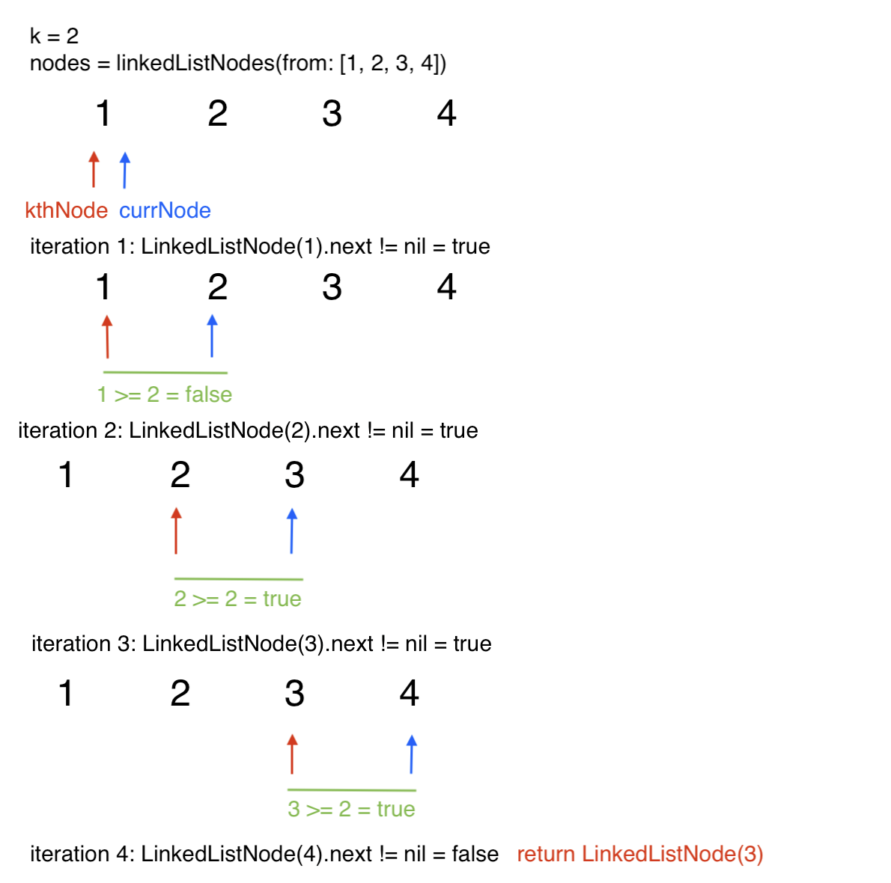

## Iterate the linked list, using pointers for the front and kth node
### time complexity: O(n)
### space complexity: O(1)

To find the kth node, pointer variables can be used while iterating the linked list. The pointer is dragged k nodes behind the current node, until the current node reaches the end and the node at the pointer in returned.

To start, two node variables are created- the currNode to track the iteration and the kthNode that is pulled by the currNode. These nodes are both initialized to be the head of the list. A while loop is created, using a variable i to track number of items. The loop executes while there is still a next node to iterate (until the end of the linked list). 
```swift
var i = 1
while let next = currNode.next { }
```

The i variable starts at 1 and not 0 becuase it is not tracking the index, but instead tracking the number from the end for the pointer. The last element of the linked list is the 1st from the end, not the 0th from the end. Because of this, i starts at 1 so it can be correctly pulled by the current node.

In the loop, the currNode is updated to the next node. the i variable is then used to checked if the kthNode is ready to be pulled along the linked list. If i is greater than or equal to k, kthNode can be progressed to follow the currNode. i is then updated.
```swift
while let next = currNode.next {
    currNode = next
    
    if i >= k {
        kthNode = kthNode.next!
    }
    
    i+=1
}
```

A guard statement is lastly used for edge cases. Edge cases include where k is higher than the number of elements in the linked list, or k is lower than 0.
```swift
guard k <= i && k > 0 else {
    throw LinkedListError.kMoreThanListLength
}
```

A visual representation is provided for understanding.



This algorithm has a time complexity of O(n), as the entire linked list needs to be iterated to get to the end and get the kthNode pointer at the correct node. Space is constant, giving a complexity of O(1).


## Iterate the linked list to find the length, then iterate again to find the kth to last
### time complexity: O(n)
### space complexity: O(1)

A possible solution would be iterating the linked list to find the length, calculating what the kth value from the end would be, then iterating again k steps until the kth node is found. The solution would look as outlined below.
```swift
var currNode: LinkedListNode = head

var count = 1
while let next = currNode.next {
    currNode = next
    count += 1
}

guard k <= count && k > 0 else {
    throw LinkedListError.kMoreThanListLength
}

let n = count - k
var nTracker = 1

var kthNode = head
while nTracker <= n {
    kthNode = kthNode.next!
    nTracker += 1
}

return kthNode
```

This solution has a time complexity of O(n) and space complexity of O(1), similar to the solution above. However, it is taking two passes through the linked list, whereas above is making a single pass. Becuase of this, the above solution is a more efficient solution. 
