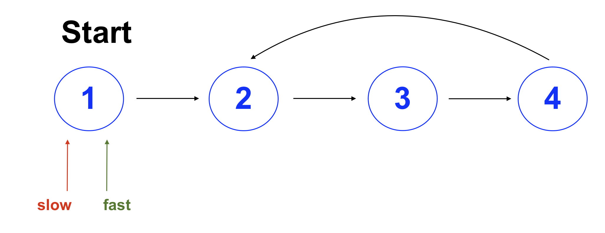

## Use pointers to cycle the list
### time complexity: O(n)
### space complexity: O(1)

For this solution, create two pointer variables starting at the head of the linked list, and push the pointers through the list. One pointer will be deemed a slow pointer, and will iterate the list one by one. The other will be a fast pointer, and will iterate the list by two. If there is a cycle in the linked list, the fast pointer will eventually catch up to the slow pointer. Otherwise, the fast pointer will reach the end of the list and there is no cycle. A visual representation is shown below:

By the third iteration, the fast pointer has caught up with the slow pointer, and it is known there is a cycle in the list. 

This solution has a time complexity of O(n), since the fast pointer will always need to iterate the whole list before catching the slow pointer or until getting to the end. Becuase the pointer variables are constant, space complexity is O(1). There is no way to improve the time complexity, therefore making this the best solution.

## Store visited nodes in a Set
### time complexity: O(n)
### space complexity: O(n)

A possible solution would be to create a Set that stores a list of the visited nodes, and iterates through the nodes to compare with visited nodes in the set. If the current node is already in the set, there is a loop.

While this solution seems simple, it requires that either the LinkedListNode value property is garunteed to be unique, or that the LinkedListNode object is Hashable. Making LinkedListNode Hashable may require some extra work, or if the class is not available for edits, a new class may have to be created.

Because of the above, this solution is not recommded. It is also not recommended because of the O(n) space complexity added from the set. There are better solution that do not require so much memory.
