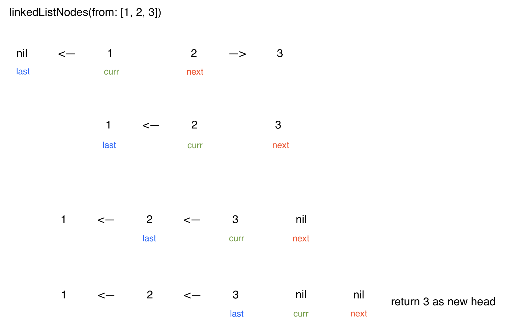

## Iterate the linked list, updating the next node of the current node to the past node
### time complexity: O(n)
### space complexity: O(1)

This solution only requires a single pass through the linked list, using pointer variables to track the current node, the past node, and the next node. 
* The current node is the node that iterates the list and will get its next value updated. 
* The past node tracks what the node before the current node is, since it will not have a connection to the current node otherwise. 
* The next node tracks what will be the next iteration is once the current node is updated, since the current node will lose its connection to the next node.
The current node starts off at the head of the list. The past node starts off as nil.
```swift 
var curr = headOfList
var past: LinkedListNode<Value>? = nil
```
At each iteration, the next node is first set to the current nodes next node before its value is updated. 
```swift 
while curr != nil {
    let next = curr?.next
```
The current node then updates its next node to be the past node, using the past node variable created, reversing that node. 
```swift 
curr?.next = past
```
The past node pointer variable is then updated to be the current node, and the current node is updated to be the next node. 
```swift 
past = curr
curr = next
```
After the list is iterated, the past node is returned as the current node will be one step too far..
```swift 
return past
```

A visual representation is provided for understanding.



This solution has a time complexity of O(n) and cannot be improved, as the entire linked list must be iterated and updated. Only constant space is added in the form of the pointer variables, resulting in a time complexity of O(1).

## Iterate the linked list, creating a new reversed linked list while iterating
### time complexity: O(n)
### space complexity: O(n)

A solution using space involes iterating the list and creating a new linked list that is reversed. New linked list nodes are created while iterating the list, and these nodes are added into the new list, ultimately reversing the list. The solution might look something like what is outlined below:
```swift 
guard let headOfList = headOfList else { return nil }

var newListHead = LinkedListNode(headOfList.value)
var curr = headOfList.next

while curr != nil {
    let newListAddition = LinkedListNode(curr!.value)
    newListAddition.next = newListHead
    newListHead = newListAddition
    curr = curr!.next
}

return newListHead
```

This solution should not be used, as it uses O(n) extra space creating a new linked list. The extra space does not improve the time complexity compared to the solutions above. There are better solutions that allow for updating the current linked list, rather than using extra space.

## Brute force: iterate the list for every node to find the node before
### time complexity: O(n^2)
### space complexity: O(1)

The brute force solution invovles re-iterating the list from the beginning every time for each node in the list until the node before is found. The node can then update its next node to eventually reverse the list. It will use a nested loop, with the outer loop iterating the linked list and the inner loop finding the node before by iterating the list again until hitting the node before the current node. This results in O(n^2) time complexity and should be avoided.

